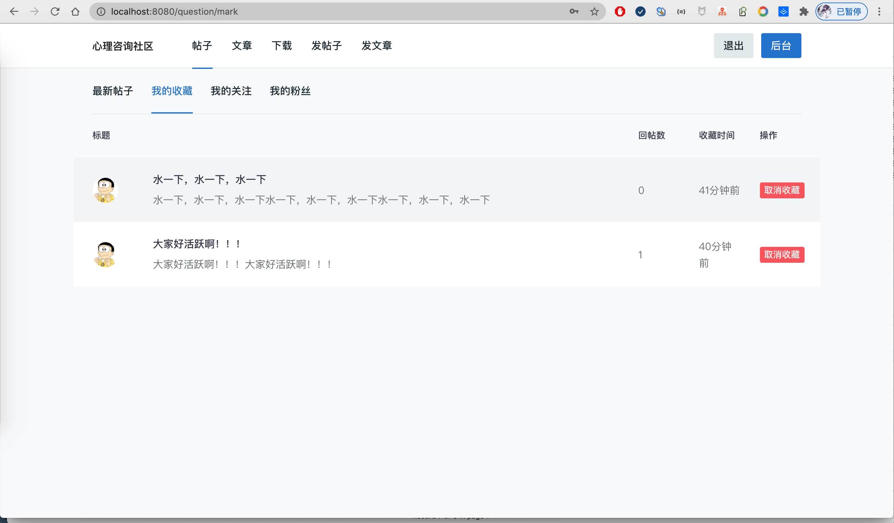
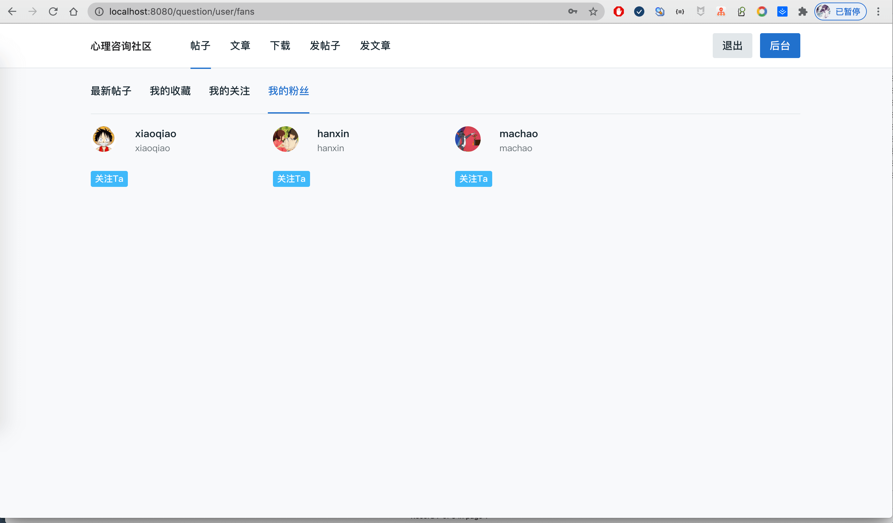
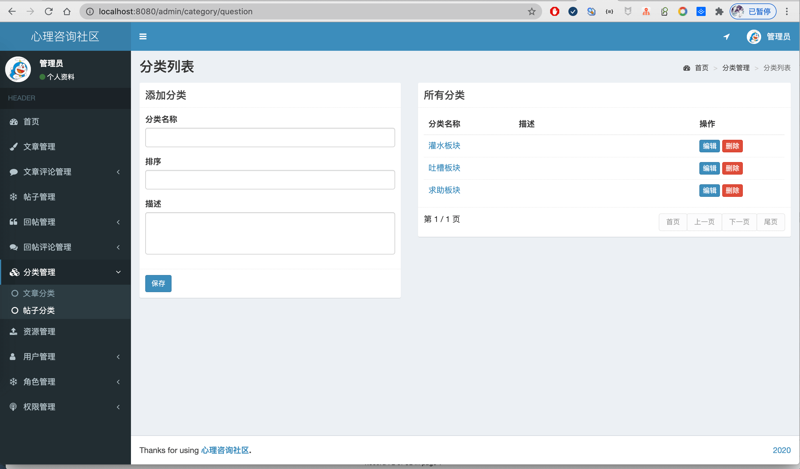

- 基于SpringBoot+MyBatis+Shiro的心理咨询论坛社区。
- 预览地址：[http://xl.liuyanzhao.com](http://xl.liuyanzhao.com)
- 详细介绍地址：[https://liuyanzhao.com/shop/PsychologyForum.html](https://liuyanzhao.com/shop/PsychologyForum.html)

## 一、功能介绍
- 包括管理员、用户两种角色
#### 用户功能如下
1. 文章管理
2. 文章评论管理
3. 帖子管理
4. 帖子回帖管理
5. 帖子回帖评论管理
6. 个人信息管理、密码修改
7. 下载资源
8. 帖子查看，我的收藏，我的关注，我的粉丝，用户主页......

#### 管理员功能如下
1. 所有文章管理
2. 所有文章评论管理
3. 所有帖子管理
4. 所有帖子回帖管理
5. 所有帖子回帖评论管理
6. 资源管理
7. 分类管理(文章分类和帖子分类)
8. 用户管理
9. 角色管理和权限管理
10. 以及用户的所有权限

## 二、技术组成
- 1、SpringBoot
- 2、MyBatis
- 3、Thymeleaf
- 4、Bootstrap
- 5、MySQL
- 6、Shiro

## 三、项目截图

